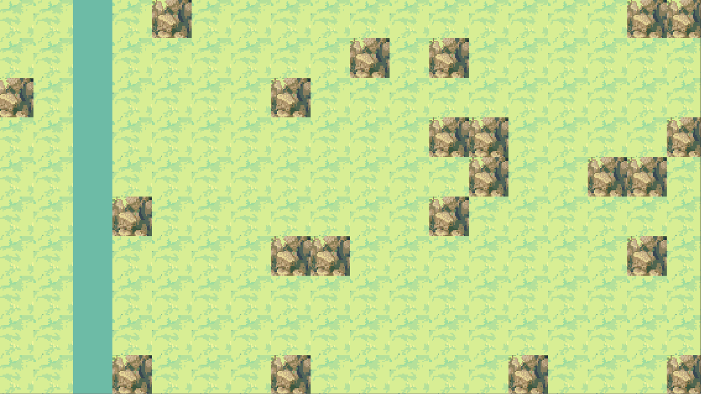

# FlyweightPattern
Study repository about the Design Pattern "Flyweight"
Based on the book Game Programming Patterns by Robert Nystrom available at:
http://gameprogrammingpatterns.com/

## Setup
This was developed with Unity 2019.3.6f1

This is a Unity project, open it with the correct Unity version and you'll be able to run it.

## Art Sources

Tilesets from Brackeys Tileset tutorials: https://forum.brackeys.com/thread-category/resources/

## Output:

